 

---

## Sobre mim

Sou **Desenvolvedor Full Stack** e estudante de **Análise e Desenvolvimento de Sistemas** na **Fatec Jales**.

Tenho foco na criação de **aplicações web, sistemas de gerenciamento, interfaces modernas e soluções voltadas a problemas reais**, atuando no frontend, backend, documentação e estruturação de projetos.

### Atualmente trabalho principalmente com:

- **React, Next.js e TypeScript**
- **Node.js, C# e .NET**
- **PostgreSQL, SQLite, Supabase e MongoDB**
- **Git, GitHub, Docker e documentação técnica**

---

## Projetos em destaque

<table>
<tr>
<td width="50%" valign="top">

### Adrenalina

Sistema de gerenciamento de **Lan House**, com aplicativo para administrador, aplicativo cliente, servidor local, autenticação, sincronização entre máquinas, backup e publicação self-contained.

**Tecnologias:**  
`.NET` `C#` `SQLite` `Desktop Apps` `ASP.NET`

 

</td>
<td width="50%" valign="top">

### SIGO

Projeto integrador voltado ao **gerenciamento de oficinas**, desenvolvido em equipe, com participação no frontend, integração com API, organização de componentes e colaboração em sprints.

**Tecnologias:**  
`React` `TypeScript` `Node.js` `API REST`

 

</td>
</tr>

<tr>
<td width="50%" valign="top">

### Civitas

Projeto acadêmico colaborativo com foco em desenvolvimento web, interfaces responsivas, componentes reutilizáveis, formulários, validações e organização de tela com boas práticas.

**Tecnologias:**  
`Next.js` `React` `TypeScript` `GitHub`

 

</td>
<td width="50%" valign="top">

### Landing Page Comercial

Landing page para clínica de estética com foco em **conversão, experiência mobile, SEO local, acessibilidade e integração com WhatsApp**.

**Tecnologias:**  
`HTML` `CSS` `JavaScript` `SEO` `Acessibilidade`

 

</td>
</tr>
</table>

---

## Formação

### Fatec Jales
**Tecnologia em Análise e Desenvolvimento de Sistemas — Cursando**

- Participação em projetos integradores
- Desenvolvimento full stack
- Trabalho em equipe com metodologias ágeis
- Uso de Git, GitHub e organização por sprints

### ETEC
**Técnico em Desenvolvimento de Sistemas — Concluído**

- Formação em programação, banco de dados e documentação
- Desenvolvimento de projetos acadêmicos e aplicações práticas

### Monografia
**A Inteligência Artificial na Educação**

---

## Stack principal

---
## Estatísticas

  

---

## Contribuições

## Contribuições

<table>
<tr>
<td width="50%" align="center" valign="top">

### Learnmath

Aplicação educacional voltada ao estudo e à organização de conteúdos acadêmicos.

 

</td>

<td width="50%" align="center" valign="top">

### Mihon

Leitor de mangás open source para Android, desenvolvido e mantido pela comunidade.

 

</td>
</tr>
</table>

 

---

## Contato

---

## Outros projetos

- [Portfólio profissional](https://github.com/CristianoRFB/Portifolio-Fatec)
- [DesignSigo](https://github.com/CristianoRFB/DesignSigo)
- [ProdutoFornecedorDOTNET](https://github.com/CristianoRFB/ProdutoFornecedorDOTNET)
- [Todos os repositórios](https://github.com/CristianoRFB?tab=repositories)

---

### Interesse constante, evolução contínua e construção de soluções reais.

